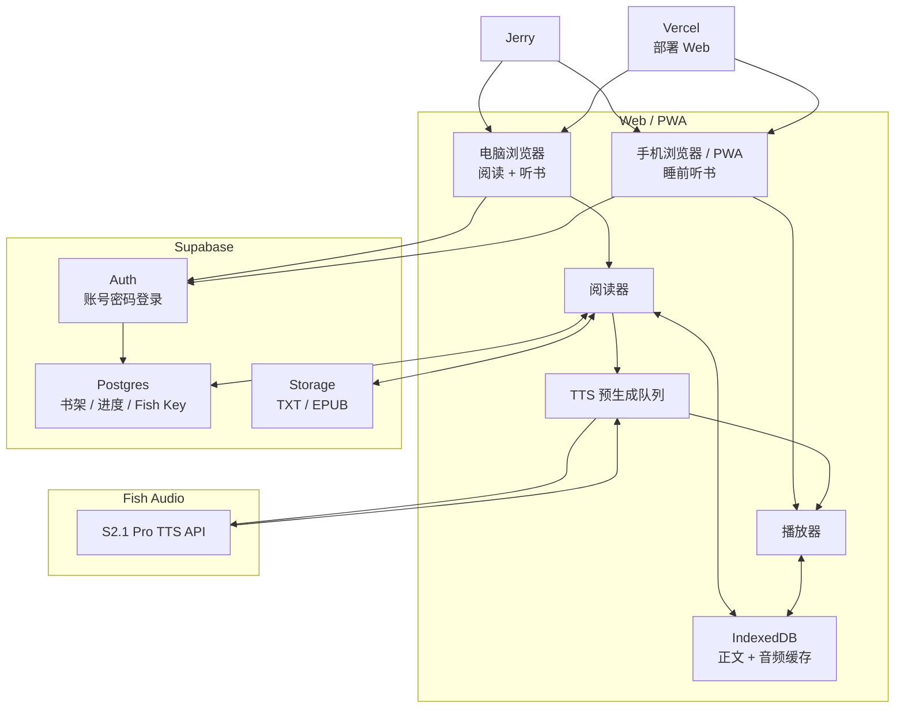

# JerryRead PRD

> 产品定位：Web-first 的个人 AI 阅读器。  
> 核心体验：电脑上边看边听，手机上睡前听书，阅读与听书进度自动同步。  
> 第一优先级：AI 语音质量，拒绝明显“塑料感” TTS。

---

## 1. 核心使用场景

### 场景 A：电脑边看边听

```text
登录 JerryRead
→ 打开《临高启明》
→ 正文阅读
→ 点击播放
→ Fish S2.1 Pro 开始朗读
→ 当前朗读段落高亮
→ 页面自动跟随
→ 阅读 / 听书进度自动保存
```

### 场景 B：手机睡前听书

```text
手机打开 JerryRead
→ 登录 Jerry 账号
→ 自动恢复上次阅读位置
→ 点击继续播放
→ 锁屏后继续听
→ 设置 30 / 60 / 90 分钟睡眠定时
→ 到时停止
→ 自动保存最终进度
```

### 场景 C：跨设备续读

```text
电脑读到第 382 章第 147 段
→ 自动同步 Supabase

晚上手机登录
→ 自动恢复到第 382 章第 147 段
→ 继续听到第 165 段

第二天电脑打开
→ 自动恢复到第 165 段
```

核心原则：

> 阅读和听书必须使用同一个正文进度，而不是记录某个 MP3 播放到了多少秒。

---

## 2. 技术路线



技术栈：

```text
Frontend
React + TypeScript + Vite

Hosting
Vercel

Cloud
Supabase Auth
Supabase Postgres
Supabase Storage

Local Cache
IndexedDB

TTS
Fish Audio S2.1 Pro
默认音色：央视频音
```

不做：

```text
自建服务器
本地 GPU TTS
Python 后端
VPS
音频云端长期存储
```

---

## 3. 数据设计

### 用户配置

`user_settings`

```text
user_id
fish_api_key
fish_model
fish_voice_id
playback_speed
default_sleep_minutes
```

Jerry 登录后从 Supabase 获取自己的 Fish API Key。

MVP 接受 Key 下发到 Jerry 自己的浏览器。

### 书籍

`books`

```text
id
user_id
title
author
file_type
storage_path
file_size
last_opened_at
```

原始 TXT / EPUB 放 Supabase Storage。

大型文件如果超过 Supabase Free 单文件限制，MVP 直接人工分为上 / 下册，不做复杂自动分片。

### 阅读进度

`reading_progress`

```text
user_id
book_id
chapter_index
paragraph_index
text_offset
updated_at
```

进度变化：

```text
立即保存 IndexedDB
→ 3 秒 debounce
→ 同步 Supabase
```

切章节、暂停播放、页面进入后台时强制同步。

多设备冲突直接使用最新 `updated_at`。

---

## 4. TTS 实现

TTS 选型：

```text
Fish Audio S2.1 Pro
```

默认使用已选定的“央视频音”。

禁止因为免费模型失败自动切换到收费模型。

### 文本切段

不能整章一次请求，也不能一句一句请求。

目标：

```text
约 150～300 个中文字符 / chunk
```

优先按：

```text
段落
→ 句号 / 问号 / 感叹号
→ 分号
→ 逗号
→ 最后才硬切
```

### 预生成

播放器必须提前生成后续音频：

```text
Chunk 100  正在播放
Chunk 101  已生成
Chunk 102  已生成
Chunk 103  生成中
Chunk 104  等待
```

MVP 默认保持后续约 5 个 chunk。

这样 Fish 偶尔慢几秒，用户也不会感知到。

### 音频缓存

Fish 返回的音频只存本地 IndexedDB。

不上传 Supabase。

缓存 Key：

```text
model + voice_id + normalized_text
```

已生成过的段落再次播放时直接命中缓存。

---

## 5. 阅读器原型

### 桌面端

```text
┌──────────────────────────────────────────────────┐
│ JerryRead                    目录   设置   Jerry │
├─────────────┬────────────────────────────────────┤
│             │                                    │
│  章节目录   │        第三百八十二章              │
│             │                                    │
│             │  文德嗣站在甲板上，看着……          │
│             │                                    │
│             │  █ 当前正在朗读的这一段 █          │
│             │                                    │
│             │  下一段正文……                      │
│             │                                    │
├─────────────┴────────────────────────────────────┤
│   上一段      ▶ / 暂停      下一段       1.0x   │
│             睡眠定时        音色                 │
└──────────────────────────────────────────────────┘
```

桌面端重点：

```text
正文为主
播放器固定在底部
当前朗读段落高亮
自动滚动跟随
```

### 移动端

```text
┌──────────────────────────┐
│ 临高启明            目录 │
├──────────────────────────┤
│                          │
│      当前章节正文        │
│                          │
│   █ 当前朗读段落 █       │
│                          │
├──────────────────────────┤
│                          │
│          ▶               │
│                          │
│   上一段       下一段    │
│                          │
│  1.0x       睡眠定时     │
│                          │
└──────────────────────────┘
```

移动端重点：

```text
听书优先
大播放按钮
睡眠定时
锁屏继续播放
Media Session 锁屏控制
```

---

## 6. 核心页面

```text
/login
/books
/reader/:bookId
/settings
```

### 登录页

只做账号密码登录。

第一版不开放注册。

### 书架页

展示：

```text
书名
当前进度
最近阅读时间
继续阅读
上传 TXT / EPUB
```

### 阅读页

必须支持：

```text
章节目录
正文阅读
播放 / 暂停
上一段 / 下一段
倍速
睡眠定时
当前段落高亮
自动滚动
自动保存进度
```

### 设置页

```text
Fish API 状态
默认音色
默认模型
默认倍速
默认睡眠时间
```

---

## 7. MVP 验收场景

JerryRead v0.1 只看这一条链是否真正跑通：

```text
Jerry 登录
→ 上传《临高启明》TXT
→ 出现在书架
→ 打开正文
→ 点击播放
→ Fish 央视频音连续朗读
→ 当前段落高亮并自动跟随
→ 自动保存进度
→ 关闭电脑

手机打开 JerryRead
→ 登录
→ 自动恢复同一本书同一位置
→ 继续播放
→ 锁屏后继续听
→ 设置 30 分钟睡眠定时
→ 到时停止并保存进度

第二天电脑打开
→ 自动恢复昨晚停止的位置
```

只要这条链稳定成立，MVP 就完成。

---

## 8. Codex 开发顺序

```text
Phase 1
项目初始化 + Vercel + Supabase Auth

Phase 2
书架 + TXT 上传 + 阅读器 + IndexedDB

Phase 3
Fish TTS + 文本切段 + TTS Queue + 连续播放

Phase 4
Supabase 阅读进度同步 + 跨设备恢复

Phase 5
PWA + Media Session + 锁屏播放 + 睡眠定时

Phase 6
EPUB 支持 + UI 优化
```

Codex 开发原则：

```text
先跑通主链路
不要一次性开发全部需求
不要做传统后端
不要把 Fish Key 写死在源码
不要把 Supabase service_role 放前端
不要上传 TTS 音频到 Supabase
阅读与听书必须共用同一个进度
Fish 免费模型失败时禁止自动切收费模型
```

---

## 9. 一句话产品定义

> JerryRead：一个以高质量 AI 语音为核心、支持跨设备续读的 Web 阅读器。
